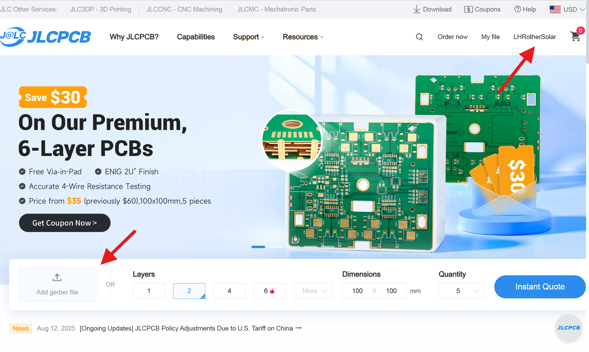
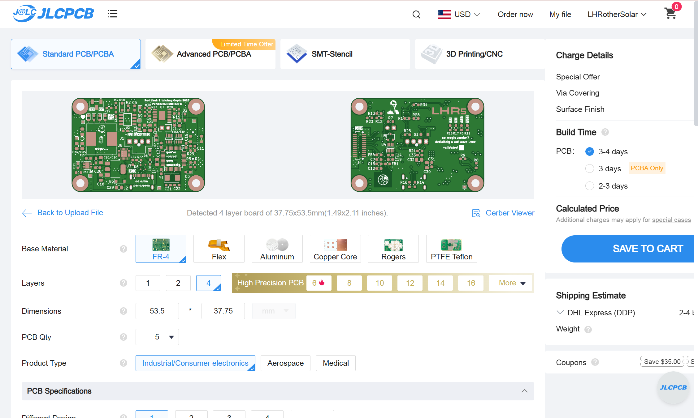
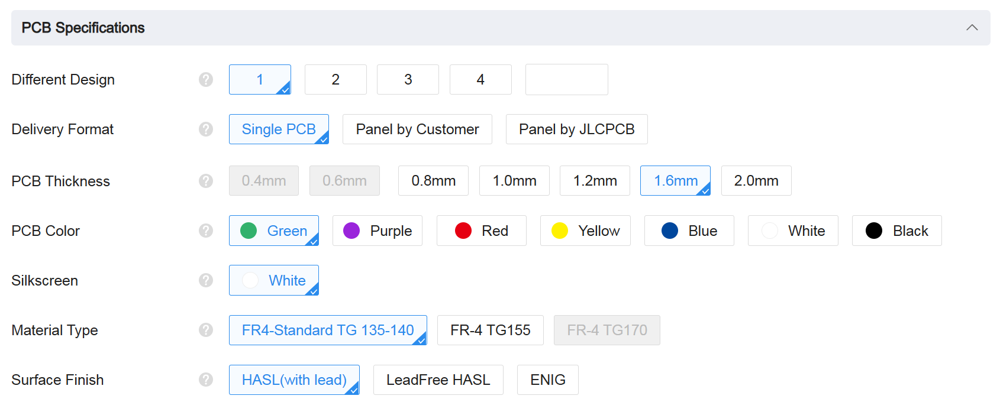

To start a PCB prototype order, go to [JLCPCB](https://jlcpcb.com/) and sign in to the LHR Solar account. Ask a lead if you need login info. Then upload your gerber zip file as shown below.

You should see an order page like this. Check that the base material is FR-4 for rigid boards and that the layer count and dimensions match your design in KiCad.

For PCB Specifications, keep the default values for everything unless you need to change a certain option.

After modifying relevant specifications, click "Save To Cart" and proceed to checkout.
