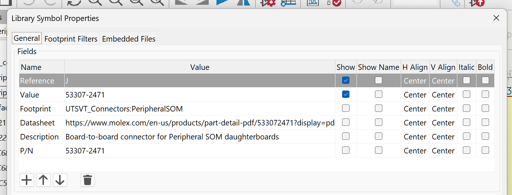
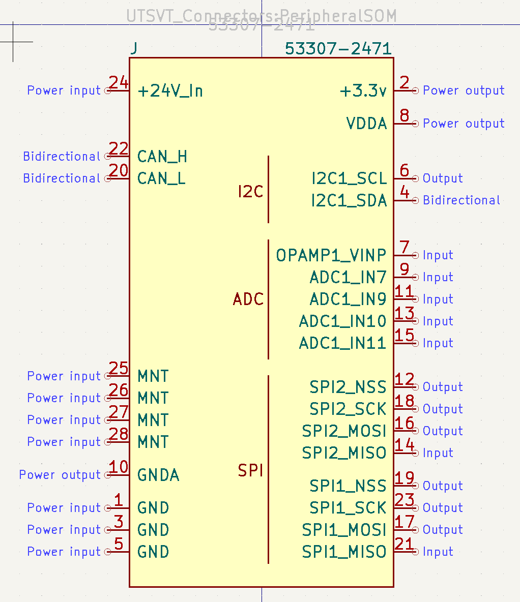
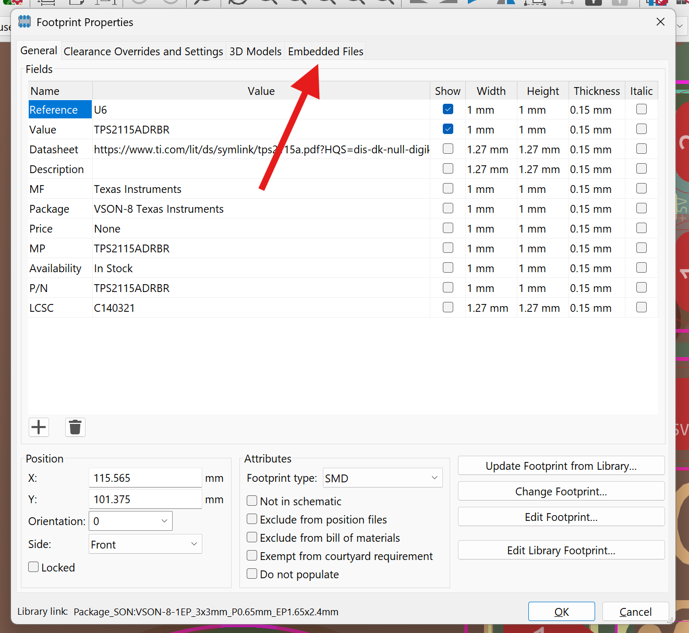
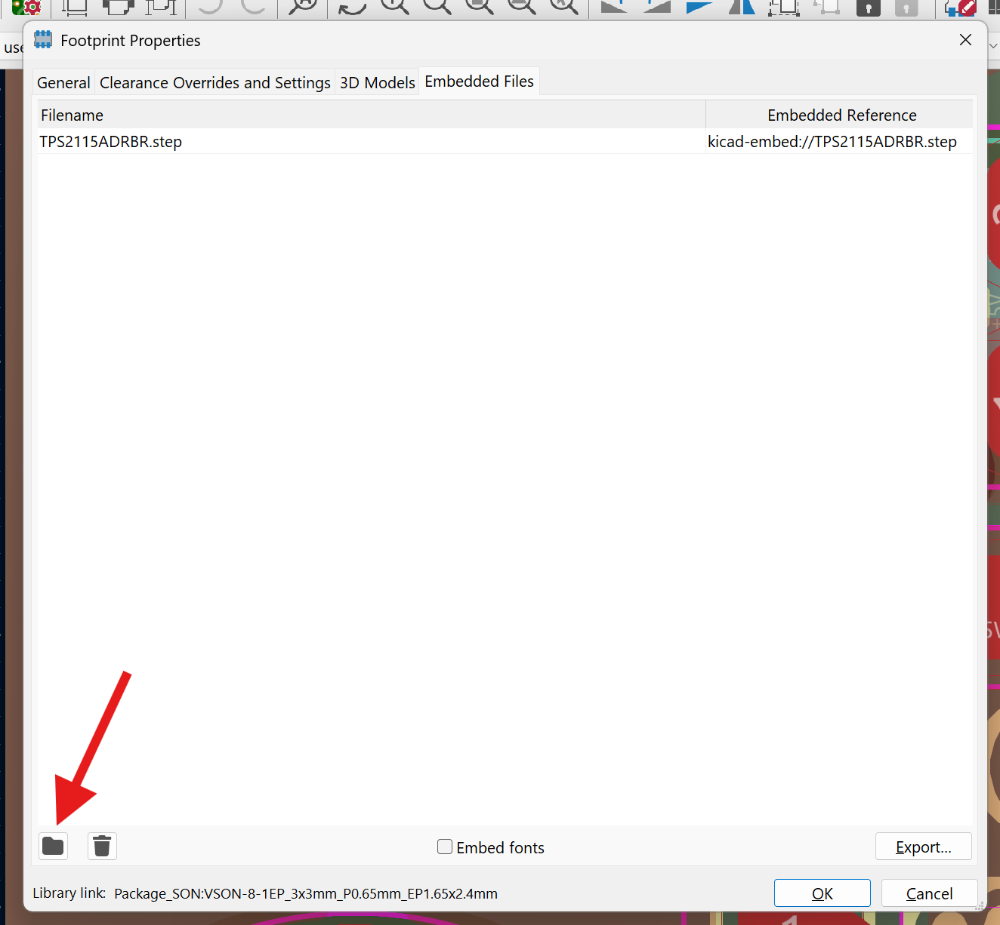
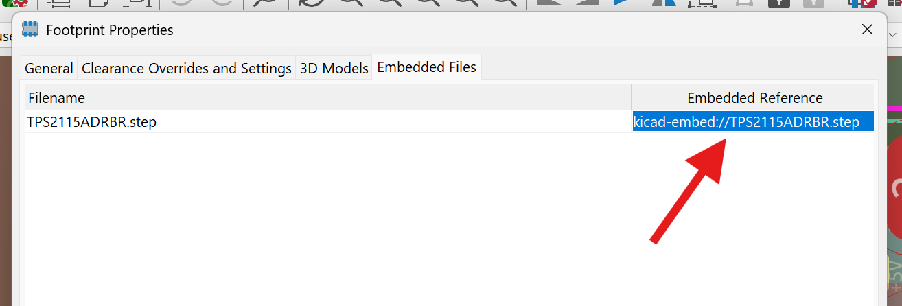

To ensure consistency throughout the team's hardware, there are a few standards to follow when contributing to the shared libraries and working on your design projects.
## Naming Convention
All Github repositories for PCBs should be named as follows: `{System}-{BoardName}PCB`. Some examples would be:

- `PS-ThermistorCollectorPCB`
- `PS-PowerDistributionUnitPCB`
- `VCAT-DashboardPCB`
## Symbols
All symbols must have the following fields populated to be merged into our shared libraries or used in an LHRs schematic.

| Field | Purpose |
|---|---|
| Reference | [Type of component](https://en.wikipedia.org/wiki/Reference_designator#Designators) |
| Value | Component value (resistance, capacitance, etc.) |
| Footprint | Footprint library & name (should be linked) |
| Datasheet | Link to the manufacturer's datasheet |
| Description | Summary of the component's functionality |
| P/N | Manufacturer's part number |

Example symbol fields would look something like this:

Additionally, symbol pins should be grouped intuitively as shown and assigned the proper functionality (power, input, output, etc.). Please double check that the pins & pin numbers actually match the package shown on the datasheet.

## Footprints
Ensure the following for all footprints:

- Footprints should match the datasheet. Please double-check
- All pins should correspond to the schematic
- Pin 1 should be clearly labeled in silkscreen
- Footprints should have accurate 3D models attached as embedded files
- Courtyards should be defined such that the soldered component won't interfere with any others
### Embedding 3D Models
Open the footprint properties by hovering over a footprint and using the 'e' hotkey. Then navigate to the Embedded Files tab.

Now add the embedded file by clicking the file icon. You can usually find the step file by searching the component part number on [SnapMagic](https://www.snapeda.com/).

Copy the reference to the embedded file as shown (double-click and ctrl-c).

Finally, add the 3D Model by pasting the embedded reference in the 3D Models tab. Modify the Scale, Rotation, and Offset until the chip lines up properly with the pads. Ensure pin 1 of the model lines up with pin 1 of the footprint. If the model doesn't show up, close and reopen the footprint properties window to refresh.

