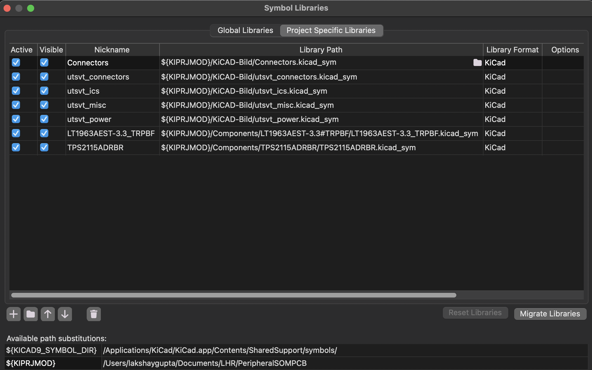

# PCB Design Workflow

## Overview
We follow this workflow when designing PCBs for the car. Sticking to this will help you develop hardware smoothly while learning a lot in the process.
## Timeline
Each step of the PCB design process should take approximately this much time (including reviews). Your timeline may vary based on board complexity and overall deadlines, and you'll get faster at iterating as you learn more, but try not to deviate too much from this.

- Requirements & Setup - 1 day
- Schematic & Part Selection - 1-2 weeks
- Layout & Routing - 2 weeks
- Production Files & Documentation - 1 day

The goal of this timeline is to ensure you have some kind of reviewable progress weekly. If you're blocked by another system/dependency, make sure they're aware so you can continue working. Don't be afraid to ask for reviews/help often to stay on track, that's what we're here for :P
## Project Setup
Follow these steps to set up a new hardware project.
### Github Repo Setup
First, ask your lead to create a Github repository to store all your project files. If they don't follow the [naming convention](Standards.md#naming-convention), they have to pay for your food next workday. Clone the repository **using SSH** and add our [pull request (PR) template](https://github.com/lhr-solar/KiCAD-Sharepoint/blob/main/PULL_REQUEST_TEMPLATE.md) to the main directory. Also add a file called `.gitignore` with [these contents](https://github.com/lhr-solar/PS-LVCarrierPCB/blob/main/.gitignore) so git knows to ignore backup/temporary files. Open your terminal and use git to add, commit, and push these files to main. Now, whenever you create a PR, the template checklist will show up for you to fill out. Finally create and switch to a branch called "RevA" using the command `git switch -c RevA`. You'll do all your work for the first revision of your board on this branch. Also add the standard rules for repos by going to your repo's settings -> Rules -> Rulesets -> New Ruleset -> Import a ruleset, and import all of the ones in the `Rules` directory
### Shared Libraries
We share several parts between our team's PCBs, including ICs, diodes, and more. This saves us from having to duplicate common symbols and footprints across projects, allowing for a single source of truth. These shared libraries can be found in [KiCAD-Sharepoint](https://github.com/lhr-solar/KiCAD-Sharepoint).

To add the shared libraries to your project, open your repository in the terminal and type `git submodule add git@github.com:lhr-solar/KiCAD-Sharepoint.git`. In the next step, you'll find out how to associate these with your KiCad project.

Note: if you're cloning a repository that already has KiCAD-Sharepoint added, you need to run `git submodule update --init --recursive` to pull the shared libraries.
### Creating a KiCad Project
Now open KiCad and create a new project (Ctrl-N). Choose your repository folder and name the KiCad project the same as your repository name. **Important**: KiCad puts all your files inside another folder, so close KiCad and move these files into the main directory as shown. Finally, delete the folder KiCad created. 

### Documentation
We all ~~hate~~ love documentation! To that end, we document all LHRs electrical projects using Confluence. For example, all Power Systems documentation can be found [here](https://cloud.wikis.utexas.edu/wiki/spaces/LHRSOLAR/folder/485753697?atlOrigin=eyJpIjoiNTVlN2Q0NWUyN2U5NGE0NmFkMWFlMjgwMmFmZjRjMTIiLCJwIjoiYyJ9). Create a new Confluence page for your board and place it under the correct system/subsystem folder. As you work on your design, fill out this [template](https://cloud.wikis.utexas.edu/wiki/spaces/LHRSOLAR/pages/484671489/Power+Systems+Documentation+Template?atl_f=PAGETREE) with your requirements, schematic/layout notes, firmware info, etc.

In addition to your Confluence page, ensure your Github repository has a `Readme.md` file with relevant information about your project. This can simply be your name, project description, images of the schematic/pcb, and a brief application note. Please also link your Confluence documentation here.
## Schematic
### Symbol Table
In order for your schematic to use the KiCAD-Sharepoint symbols, you need to add the symbol libraries to your schematic's symbol table, which defines the locations of all your symbols. Symbol libraries are stored in '.kicad_sym' files

- Open your schematic file from your KiCAD project
- Go to Preferences -> Manage Symbol Libraries -> Project Specific Libraries
- Press the + sign at the bottom
- In Library Path press the folder button add one of the .kicad_sym files in the KiCAD-Sharepoint submodule
- Set the nickname to be whatever is in the front of the .kicad_sym file, i.e if it's called `utsvt_connectors.kicad_sym`, make the nickname `utsvt_connectors`. 
- Keep in mind that other people should be able to open your KiCAD-Project without the libraries being broken. So if the library path is `users/lakshay` then that link will be broken since they probably don't have that path. All of your library paths should be relative to the KiCAD project, which KiCAD has that path stored in this variable: `${KIPRJMOD}`
- Repeat these steps for the other .kicad_sym files in KiCAD-Sharepoint.  

Once you start adding your own symbol libraries for your board, you also need to add that .kicad_sym to the the symbol table.

This is what a finalized symbol table should look like:
  
Note that all of the paths use `${KIPRJMOD}`, so every path is relative to where the KiCAD Project is stored, which changes depending on the user.
### Hierarchical Design
### Electrical Rules Check
Before moving onto layout, make sure to run the Electrical Rules Checker (ERC). The ERC checks your schematic to see if anything is unconnected, or not following any of KiCAD's rules. This doesn't check electrical functionality, that's up to you :) 

To run an ERC go to Inspect -> Electrical Rules Checker -> Run ERC. 
Some errors you can ignore like "output pin not driven by inputs", but usually it's better to just leave them and ask someone else to check your errors to see if they're actual errors as a sanity check. Once you're 100% sure those errors aren't actually errors you can right click the error and press "Exclude Violation".  
After you run the ERC it leaves all of the markers there to indicate where the ERC error or warning is, if that gets annoying you can just press Delete All Markers in the ERC menu.

## Part Selection
### Standardized Components
When selecting components, it's always preferable to pick a component from our [Standardized Passive Components](https://utexas.sharepoint.com/:x:/r/sites/ENGR-LonghornRacing/_layouts/15/doc.aspx?sourcedoc=%7B6c03da27-3760-468e-8615-db3cc3062e75%7D&action=edit) list since this includes components we've bought before, have inventory of, or have proven worked before.   
Do this before selecting footprints
Select footprints
TODO
## Layout & Routing 
Put stuff on board
Edge cuts
Mounting
Planes/Stackup
TODO
### PCB Constraints
When manufacturing a PCB, there are constraints that are given to us by the manufacturer based on how precise their manufacturing equipment is. The following are JLCPCB Manufacturing Capabilities.
When creating the layout of your board, select File -> Board Setup -> Constraints and set them to the following values:

* Minimum Clearance (2 layer): 0.127mm
* Minimum Track Width (2 layer): 0.127mm
* Minimum Clearance (4 layer): 0.09mm
* Minimum Track Width (4 layer): 0.09mm
* Minimum Connection Width: 0.0mm
* Minimum Annular Width: 0.13mm
* Minimum Via Diameter (2 layer): 0.5mm
* Minimum Via Diameter (4 layer): 0.25mm
* Copper to Hole Clearance: 0.254mm
* Copper to Edge Clearance: 0.3mm
* Minimum Through Hole: 0.3mm
* Hole to Hole Clearance: 0.5mm
* Minimum Item Clearance: 0.15mm

## Review Process
PCB reviews are handled through Github pull requests. To create a PR, follow [these steps](https://docs.github.com/en/pull-requests/collaborating-with-pull-requests/proposing-changes-to-your-work-with-pull-requests/creating-a-pull-request). The PR template should automatically show up, with a checklist to fill out to make sure your PCB is up to standards. Assign reviewers using the sidebar as shown - make sure to assign at least 2 or 3 reviewers (usually your lead/sublead but can be any experienced member). Also ensure you're listed as the assignee for the PR.

Now copy the Github link to your PR and send it in the `#review-request` channel on Slack. Mention the reviewers you requested, and feel free to bug them if they don't respond/review in the next couple of days. To keep the review process quick, you should aim to respond to review comments as fast as possible, but make sure you understand what the reviewers are saying. If you're confused about a concept or technical detail, don't hesitate to ask (as a Github reply). It's always better to ask than to take feedback blindly :)
## Generating Production Files
When your schematic and layout have been approved, there's one last step before ordering it - generating production files. These files tell the fabrication house how to actually cut the board edges, drill vias, and deposit copper onto the board. To generate production files for JLC (Gerbers, BOM, and CPL), use the JLCPCB Tools plugin as described [here](KiCad-Setup.md#kicad-jlcpcb-tools).
## Ordering
Follow the [ordering instructions](./Ordering.md) to order your PCB prototype using JLCPCB. Usually we order in a couple of batches per revision cycle, so reach out to your lead to confirm your order timeline.

## Exporting PCB 3D Models
You can export a STEP file (a 3D file) with all of your components for integration with mechanical designs.  

In the PCB editor go to File -> Export -> STEP
Make sure the following properties are set:

* `Format` is STEP
* `Coordinates` is Board Centered Origin
* `Export Board Body` is checked

Press `Export` to export the STEP file. Make sure it is pushed to your repo with a clear name!
